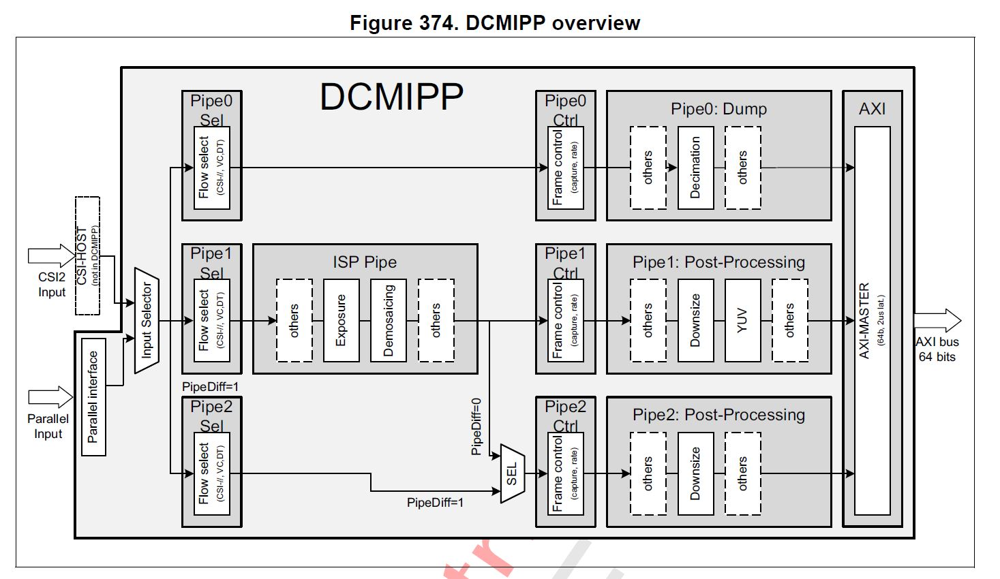

# Application overview

## Memory Footprint Details

### Read-Only data

| Name                | Size      | Location | Notes                        |
|---------------------|-----------|----------|------------------------------|
| `network_data`      | 10.55  MB | .rodata  | FLASH xSPI2 8b               |

### Read-Write data

| Name                  | Size      | Location                  | Notes                                     |
|-----------------------|-----------|-------------------------  |-------------------------------------------|
| `nn_in_buffer`               | 147 kB    |  |         (224x224x3 in RGB888)      |
| `activations`         | 343 kB    | `0x342E0000`              | NPURAMS                                   |

## DCMIPP and ISP

### DCMIPP overview

- Pipe 2 is enabled using `CMW_CAMERA_Start(0, DCMIPP_PIPE2, *ptr_dst, CAMERA_MODE_SNAPSHOT);` to capture one frame (in the `nn_in` buffer) before launching the inference in the NPU.
- For each capture the ISP configuration is updated to enhance the image quality depending on the illumination conditions. It is initialized through `ISP_Init` and then executed with `ISP_BackgroundProcess`.

For more details of DCMIPP see Digital camera interface pixel pipeline (DCMIPP) in STM32N6 Reference manual.
