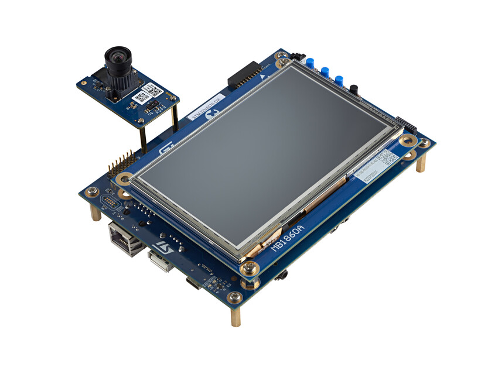
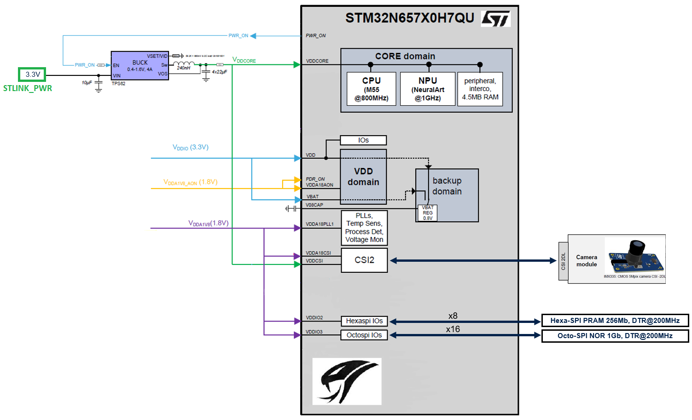
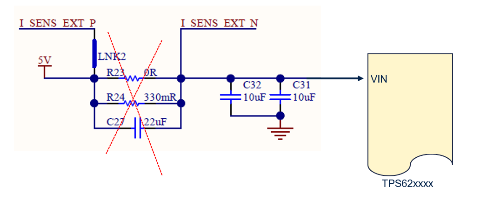
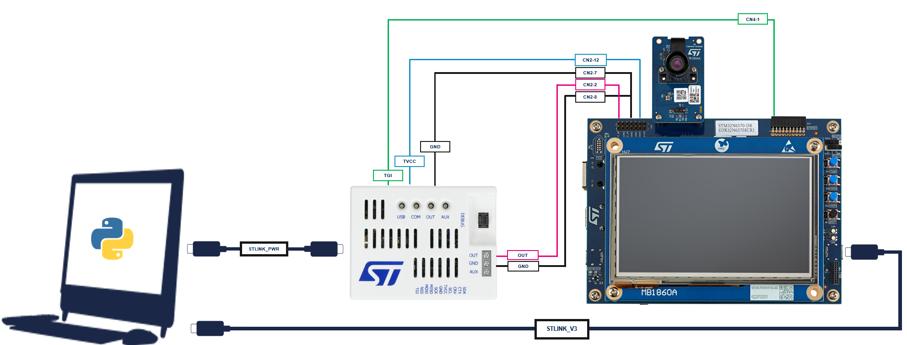
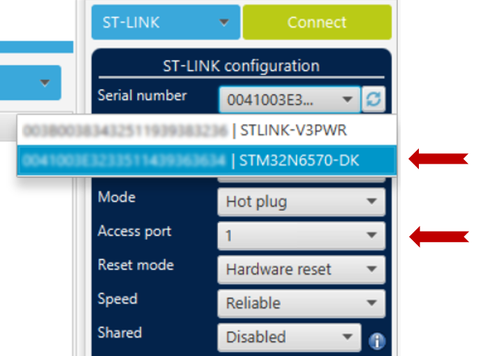

# `x-cube-n6-ai-power-measurement`

Computer Vision application to enable the deployment of object detections models on STM32N6570-DK board and to measure power consumption.

This application is prebuilt with a people detection model "TinyYOLOv2".

This top readme gives an overview of the app. Additional documentation is available in the [Doc](./Doc/) folder.

> **⚠️ Warning:** this application requires a hardware modification of the DK board (see [Power measurement environment](README.md#hardware-modifications)).

## Table of Contents

README Content

- [Features demonstrated in this example](#features-demonstrated-in-this-example)
- [Hardware Support](#hardware-support)
- [Tools version](#tools-version)
- [Boot modes](#boot-modes)
- [Quickstart using prebuilt binaries](#quickstart-using-prebuilt-binaries)
  - [How to Program hex files using STM32CubeProgrammer UI](#how-to-program-hex-files-using-stm32cubeprogrammer-ui)
  - [How to Program hex files using Command line](#how-to-program-hex-files-using-command-line)
- [Quickstart using source code](#quickstart-using-source-code)
  - [Application build and run - Dev mode](#application-build-and-run---dev-mode)
    - [STM32CubeIDE](#stm32cubeide)
    - [IAR EWARM](#iar-ewarm)
    - [Makefile](#makefile)
  - [Application build and run - Boot from flash](#application-build-and-run---boot-from-flash)
    - [STM32CubeIDE](#stm32cubeide-1)
    - [IAR EWARM](#iar-ewarm-1)
    - [Makefile](#makefile-1)
- [Known Issues and Limitations](#known-issues-and-limitations)

Doc Folder Content

- [Application overview](Doc/Application-Overview.md)
- [Boot Overview](Doc/Boot-Overview.md)
- [Deploy your tflite model](Doc/Deploy-your-tflite-Model.md)
- [STM32N6570-DK Revision build options](Doc/Build-Options.md#revision)
- [Camera build options](Doc/Build-Options.md#cameras-module)
- [Camera Orientation](Doc/Build-Options.md#camera-orientation)
- [Aspect Ratio mode](Doc/Build-Options.md#aspect-ratio-mode)

## Features demonstrated in this example

- Sequential application flow
- NPU accelerated quantized AI model inference
- DCMIPP pipe
- DCMIPP crop, decimation, downscale
- DCMIPP ISP usage
- Dev mode
- Boot from External Flash
- Wake-up from sleep using USER1 button
- System requency scaling (switching betwing Overdrive and nominal modes)
- De-init of unused IPs
- CPU sleep during capture and during NPU HW epochs (ASYNC mode)

## Hardware Support

The development platform:
- [STM32N6570-DK](https://www.st.com/en/evaluation-tools/stm32n6570-dk.html) discovery board
  - The board should be connected to the onboard ST-LINK debug adapter CN6 with a __USB-C to USB-C cable to ensure sufficient power__
  - __Set the boot mode in dev mode__ (BOOT1 switch to right position. BOOT0 switch position doesn't matter)
  - OTP fuses are set in this example for xSPI IOs in order to get the maximum speed (200MHz) on xSPI interfaces

And one of the following camera modules:
- Provided IMX335 camera module 
- [STEVAL-55G1MBI](https://www.st.com/en/evaluation-tools/steval-55g1mbi.html)
- [STEVAL-66GYMAI1](https://www.st.com/en/evaluation-tools/steval-66gymai.html)

> **⚠️ Warning:** for power measurement, only IMX335 camera has been tested.



STM32N6570-DK board with MB1854B IMX335.


## Measuring Power Consumption using STM32N6 Discovery Board

To measure the power consumption of an STM32N6 Discovery Board (DK), particularly the core domain supply (IddCore/VddCore), which includes the CPU, NPU, interconnects, and CSI Phy digital supply, certain hardware modifications are required. 

Specifically, these modifications involve removing components to allow the application of the VddCore voltage upstream of the SMPS using an STLINK_PWR and measuring the consumed current. Simultaneously, the firmware will log a timestamp of the different stages of the code to delineate them and accurately measure the consumption of each step. These data (consumed current and timestamps) are then retrieved by Python scripts, which process them to generate a detailed report of the power consumption.



### Hardware Modifications

#### Component Removal

Remove the components **R23**, **R24**, and **C27** from the DK board. This step is crucial to allow the reinjection of current using the **STLINKPOWER_v3** tool through **I_SENS_EXT_N** pin.



Component to remove on board :


#### Current Injection

The **STLINKPOWER_v3** tool will be used to inject current before the external SMPS (3.3V). Note that the efficiency of the SMPS must be considered when measuring power. For instance:

- **TPS62088**: Efficiency is approximately 0.85% (for DK version C02), this value should be the one to be used in filed `efficiency: 0.85` in file [my_configuration.yml](./Utilities/pwr_scripts/my_configuration.yml)


### Power Measurement Setup



#### STLink_Pwr to N6 DK Pin Connections (for VddCore)

To properly connect the STLink_Pwr tool to the N6 DK board, use the following pin mappings. Note that `CNx-y` refers to the connector header `CNx` on the DK board, where `y` is the pin number of the header.

| **STLink_Pwr Pin** | **N6 DK Pin**            |
|--------------------|--------------------------|
| **OUT**            | CN2-2 (I_SENS_EXT_N)     |
| **GND**            | CN2-8 (GND)              |
| **TGI**            | CN4-1 (PG5)              |
| **TVCC**           | CN2-12 (I_SENS_VDDIO_N)  |
| **GND**            | CN2-7 (GND)              |


#### Additional Information

For debugging in development mode, the embedded **STLINK_v3** on the DK board is used. It is also utilized to receive power timestamps. It is crucial to use a **USB-C to USB-C cable** for this connection.

A second **USB-C to USB-C cable** is used to connect the **STLINK_PWR** to the computer to obtain power consumption measurements.

Both devices are interfaced with the power measurement Python scripts.

### Python Scripts

Utilize the Python scripts located in the `Utilities/pwr_scripts` directory. These scripts not only measure power consumption but also provide timestamps from the application. This feature is essential for accurately identifying and locating all steps and sequences of the application.
detailed instructions to use these scripts are listed in this [README.md](./Utilities/pwr_scripts/README.md)

## Tools version

- IAR Embedded Workbench for Arm (**EWARM 9.40.1**) + N6 patch ([**EWARMv9_STM32N6xx_V1.0.0**](STM32Cube_FW_N6/Utilities/PC_Software/EWARMv9_STM32N6xx_V1.0.0.zip))
- STM32CubeIDE (**STM32CubeIDE 1.17.0**)
- STM32CubeProgrammer (**v2.18.0**)
- [STEdgeAI](https://www.st.com/en/development-tools/stedgeai-core.html) (**v2.1.0**)


## Boot modes

The STM32N6 does not have any internal flash. To retain your firmware after a reboot, you must program it in the external flash. Alternatively, you can load your firmware directly from SRAM (dev mode). However, in dev mode if you turn off the board, your program will be lost.

__Boot modes:__

- Dev mode: load firmware from debug session in RAM (boot switch to the right)
- Boot from flash: Program firmware in external flash (boot switch to the left)

## Preliminary Steps before any power measurement
  1. rework board as explained in [Power Measurement Setup](#power-measurement-setup)
  1. Switch BOOT1 switch to right position
  2. Connect the DK board using a USB-C to USB-C cable.
  3. Connect the STLINK_PWR as explained in chapter [Power Measurement Setup](#power-measurement-setup).
  4. update `Utilities/pwr_scripts/example_configuration.yml` file with the serial numbers of used devices (see [update_config_file](./Utilities/pwr_scripts/README.md#list-devices-to-identify-stlink-serial-numbers))
  5. run command `python ./capture.py power -c my_configuration.yml on` to provide VddCore (see [power_on_VddCore](./Utilities/pwr_scripts/README.md#power-on-power-device-to-load-firmware)).

__Note__: This application does not use LCD. It only sends data over a VIRTUAL COM port, which is processed by the consumption measurement scripts.
## Quickstart using prebuilt binaries

Three binaries must be programmed in the board external flash using the following procedure:

  1. Switch BOOT1 switch to right position
  2. Connect the DK board using a USB-C to USB-C cable.
  3. Connect the STLINK_PWR as explained in chapter [Power Measurement Setup](#power-measurement-setup).
  4. Power the VddCore (see [power_on_VddCore](./Utilities/pwr_scripts/README.md#power-on-power-device-to-load-firmware)).
  5. Open STM32CubeProgrammer and choose the serial number corresponding to the STLINK embedded in the DK (STM32N6570-DK).
  
  6. Program `Binary/ai_fsbl.hex` (First stage boot loader)
  7. Program `Binary/network_data.hex` (params of the network; To be changed only when the network is changed)
  8. Program `Binary/x-cube-n6-ai-power-measurement.hex` (firmware application)
  9. Switch BOOT1 switch to Left position
  10. Power cycle the board
  11. Power cycle the STLINK-V3PWR `python ./capture.py power -c my_configuration.yml off` and then `python ./capture.py power -c my_configuration.yml on`
  12. use command `python ./capture.py capture -c my_configuration.yml  -w capture_full.csv` to get power measurement data
  13. generate report using command `python ./full_sequence_power.py capture_full.csv`
  14. generate plot using command `python ./capture.py display -r capture_full.csv`

__Note__: This application does not use LCD. It only sends data over a VIRTUAL COM port, which is processed by the consumption measurement scripts.

__Note__: The `Binary/x-cube-n6-ai-power-measurement.hex` firmware is built for MB1939 STM32N6570-DK with IMX335 Camera module.


### How to Program hex files using STM32CubeProgrammer UI

See [How to Program hex files STM32CubeProgrammer](Doc/Program-Hex-Files-STM32CubeProgrammer.md)

### How to Program hex files using Command line

Make sure to have the STM32CubeProgrammer bin folder added in your path.

```bash
export DKEL="<STM32CubeProgrammer_N6 Install Folder>/bin/ExternalLoader/MX66UW1G45G_STM32N6570-DK.stldr"

# First Stage Boot loader
STM32_Programmer_CLI -c port=SWD mode=HOTPLUG -el $DKEL -hardRst -w Binary/ai_fsbl.hex

# Network parameters and biases
STM32_Programmer_CLI -c port=SWD mode=HOTPLUG -el $DKEL -hardRst -w Binary/network_data.hex

# Application Firmware
STM32_Programmer_CLI -c port=SWD mode=HOTPLUG -el $DKEL -hardRst -w Binary/x-cube-n6-ai-power-measurement.hex
```

## Quickstart using source code

Before building and running the application you have to program `network_data.hex` (model weights and biases).
This step only has to be done once unless you change AI model.
See [Quickstart using prebuilt binaries](#quickstart-using-prebuilt-binaries) for details.

More information about boot modes is available at [Boot Overview](Doc/Boot-Overview.md)

### Application build and run - Dev mode

__Make sure to have the switch to the right side.__

#### STM32CubeIDE

Double click on `STM32CubeIDE/.project` to open project in STM32CubeIDE. Build and run with build and run buttons.

#### IAR EWARM

Double click on `EWARM/Project.eww` to open project in IAR IDE. Build and run with build and run buttons.

#### Makefile

Before running commands below be sure to have commands in your PATH.

1. Build project using the provided `Makefile`:

```bash
make -j8
```

2. Open a gdb server connected to the STM32 target:

```bash
ST-LINK_gdbserver -p 61234 -l 1 -d -s -cp <path-to-stm32cubeprogramer-bin-dir> -m 1 -g
```

3. In a separate terminal session launch a GDB session to load the firmware image into the device memory:

```bash
$ arm-none-eabi-gdb build/Project.elf
(gdb) target remote :61234
(gdb) monitor reset
(gdb) load
(gdb) continue
```

### Application build and run - Boot from flash

__Make sure to have the switch to the right side.__

#### Build the application

##### STM32CubeIDE

Double click on `STM32CubeIDE/.project` to open project in STM32CubeIDE. Build and run.

__Known issue__: Some warnings are interpreted as error (displayed in red). Build is still successful.

##### Makefile

Before running commands below be sure to have commands in your PATH.

Build project using the provided `Makefile`:

```bash
make -j8
```

#### Program the firmware in the external flash


Once your app is built with Makefile, STM32CubeIDE, or EWARM, you can add a signature to the bin file:
```bash
STM32_SigningTool_CLI -bin build/Project.bin -nk -t ssbl -hv 2.3 -o build/Project_sign.bin
```

and then you can program the bin file at the address `0x70100000`;

```bash
export DKEL="<STM32CubeProgrammer_N6 Install Folder>/bin/ExternalLoader/MX66UW1G45G_STM32N6570-DK.stldr"

# Adapt build path to your IDE
STM32_Programmer_CLI -c port=SWD mode=HOTPLUG -el $DKEL -hardRst -w build/Project_sign.bin 0x70100000
```

Note: Only the App binary needs to be programmed if the fsbl and network_data.hex was previously programmed.
__Put the switch to the left side.__

Do a power cycle to boot from the external flash.
( Power cycle the STLINK-V3PWR `python ./capture.py power -c my_configuration.yml off` and then `python ./capture.py power -c my_configuration.yml on` )

## `x-cube-n6-ai-power-measurement` usage
When the application is running, it waits for a user action to trigger one iteration of the main loop. During this iteration, it initializes the camera and captures an image, performs neural network inference, and then executes post-processing. After completing these steps, the application returns to sleep mode, awaiting the next user action.

The user have to use `./Utilities/pwr_scripts/` to perform power measurement of each iteration and get power values for each step of the main loop.

usage example:
1. Connect the DK board using a USB-C to USB-C cable.
2. Connect the STLINK_PWR as explained in chapter [Power Measurement Setup](#power-measurement-setup).
3. update `Utilities/pwr_scripts/example_configuration.yml` file with the serial numbers of used devices (see [update_config_file](./Utilities/pwr_scripts/README.md#list-devices-to-identify-stlink-serial-numbers))
4. run command `python ./capture.py power -c my_configuration.yml on` to provide VddCore (see [power_on_VddCore](./Utilities/pwr_scripts/README.md#power-on-power-device-to-load-firmware)).
5. load and run application
6. run command `python ./capture.py capture -c my_configuration.yml  -w capture_full.csv`
7. the following message will immediately be displayed:
    ```
    CAPTURING : press wake-up button
    ```
8. press USER1 button on DK board
9. wait "capture DONE" message 
    ```
    CAPTURE DONE 
    ```
10. [Generate report](./Utilities/pwr_scripts/README.md#generate-power-report)
  `python ./full_sequence_power.py capture_full.csv`
11. [Generate and display plot](./Utilities/pwr_scripts/README.md#display-csv)  `python ./capture.py display -r capture_full.csv`

12. to display all clocked IPs: ` python ./full_sequence_power.py capture_full.csv -c`


## Known Issues and Limitations
- Only IMX335 camera has been tested
- NN_WIDTH and NN_HEIGHT must be a multiple of 16.
- NN_WIDTH and NN_HEIGHT must be equal.
- Only RGB888 format for nn input has been tested.
- Only UINT8 format for nn input is supported.
- The HSE clock is used by default in the power measurement application to avoid clock drift.
- In this application, the LCD is not used.

