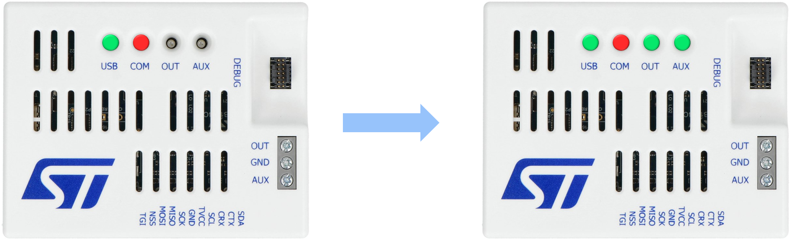
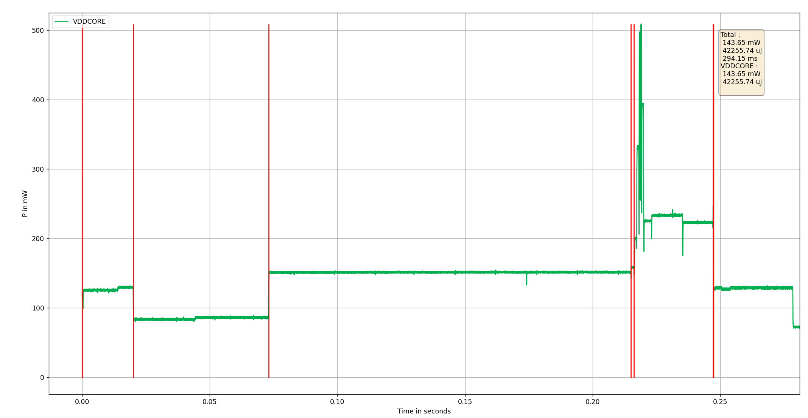

# STM32N6 Power Capture Utilities

## Requirements

- Python 3
- matplotlib
- pyserial
- pyyaml
- PyQt5

- STM32N670-DK board rework for power measurements
- STLINK-V3PWR

## Usage

### List devices to identify STLINK serial numbers

    python ./capture.py list


A template configuration file is provided as `example_configuration.yml`. This file must be modified and ideally renamed to `my_configuration.yml`. You need to adjust the serial number for each of the devices used, which can be obtained with the following command: 
```
$ python ./capture.py list
Detected 3 ST-Link Power Ctrl device(s)
  COM27 003B00383432511939383236
  COM32 0041003E3233511439363634               <= stlink_com_ctrl serial number
  COM28 003B00383432511939383236 (STLink PWR)  <= stlink_pwr_ctrl serial number
```

* Example of `my_configuration.yml` file after adding the correct serial numbers

```yaml
devices:
  - {
      type: stlink_pwr_ctrl,
      name: VDDCORE,
      vdd: 3.3,
      efficiency: 0.87,
      serial: 003B00383432511939383236 
    }
  - {
      type: stlink_com_ctrl,
      baud_rate: 115200,
      serial: 0041003E3233511439363634
    }
```

### Power on power device to load firmware

    python ./capture.py power -c my_configuration.yml on
  


### capture and write csv

    python ./capture.py capture -c my_configuration.yml  -w capture_full.csv

### Generate power report

    python ./full_sequence_power.py capture_full.csv

* Example of generate report
```
python ./full_sequence_power.py capture_full.csv
-------------------------------------------------------
1 :          2393.54 uJ in    19.97 ms for camera started                 ( 119.86 mW)
2 :          4257.77 uJ in    53.04 ms for wait frame                     (  80.27 mW)
3 :         20662.80 uJ in   141.98 ms for NOR flash init                 ( 145.53 mW)
4 :           180.60 uJ in     1.20 ms for nn_buffer copy                 ( 150.50 mW)
5 :           8068.1 uJ in    30.46 ms for nn inference                   ( 264.87 mW)
6 :            12.04 uJ in     0.08 ms for post processing                ( 150.50 mW)
-------------------------------------------------------
                34547.8 uJ in    247.2 ms for all steps
```

additional options:
- to generate details of all measured power if more than one STLinkpwr is used : 
```
python ./full_sequence_power.py capture_full.csv -v
```

- to display all clocked IPs: 
```
python ./full_sequence_power.py capture_full.csv -c
```

### Display csv

    python ./capture.py display -r capture_full.csv


* Example of generate report




